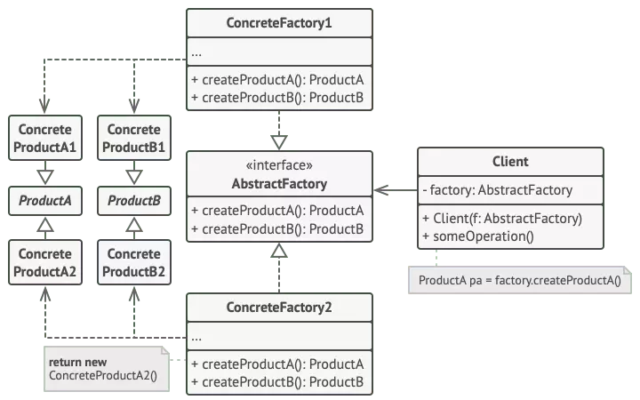
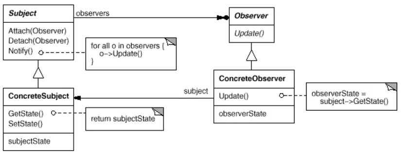

# Design pattern

### Desgin pattern là gì?

Design pattern là các giải pháp tổng thể đã được tối ưu hóa, được tái sử dụng cho các vấn đề phổ biến trong thiết kế
phần mềm mà chúng ta
thường gặp phải hàng ngày. Đây là tập các giải pháp đã được suy nghĩ, đã giải quyết trong tình huống cụ thể. là kỹ thuật
phần mềm, không phải ngôn ngữ cụ thể nào.

### Design pattern có tác dụng gì?

Những lập trình viên có thể áp dụng giải pháp này để giải quyết các vấn đề tương tự. Các vấn đề mà bạn gặp phải có thể
bạn sẽ tự nghĩ ra cách giải quyết nhưng có thể nó chưa phải là tối ưu.
Bạn cần phải hiểu rõ nó không phải là ngôn ngữ cụ thể nào cả. Design patterns có thể thực hiện được ở phần lớn các ngôn
ngữ lập trình. Nó giúp bạn giải quyết vấn đề một cách tối ưu nhất,
cung cấp cho bạn các giải pháp trong lập trình hướng đối tượng (OOP).

### Tại sao phải sử dụng Design Pattern?

- Giúp sản phẩm của chúng ta linh hoạt, dễ dàng thay đổi và bảo trì hơn.
- Có một điều luôn xảy ra trong phát triển phần mềm, đó là sự thay đổi về yêu cầu. Lúc này hệ thống phình to, các tính
  năng mới được thêm vào trong khi performance cần được tối ưu hơn.
- Design pattern cung cấp những giải pháp đã được tối ưu hóa, đã được kiểm chứng để giải quyết các vấn đề trong software
  engineering. Các giải pháp ở dạng tổng quát, giúp tăng tốc độ phát triển phần mềm bằng cách đưa ra các mô hình test,
  mô hình phát triển đã qua kiểm nghiệm.
- Những lúc khi bạn gặp bất kỳ khó khăn đối với những vấn đề đã được giải quyết rồi, design patterns là hướng đi giúp
  bạn giải quyết vấn đề thay vì tự tìm kiếm giải pháp tốn kém thời gian.
  Giúp cho các lập trình viên có thể hiểu code của người khác một cách nhanh chóng (có thể hiểu là các mối quan hệ giữa
  các module chẳng hạn). Mọi thành viên trong team có thể dễ dàng trao đổi với nhau để cùng xây dựng dự án mà không tốn
  nhiều thời gian.

### Phân loại Desgin patterns.

Chia thành các nhóm:

- Creational pattern( nhóm khởi tạo)

    - abstract Factory pattern
    - singleton
    - Factory method
    - Builder
    - prototype
- structral pattern ( Nhóm cấu trúc )

    - adapter
    - Bridge
    - Composite
    - Decorator
    - Facade
    - Flyweight
    - proxy
- Behavioral pattern

    - Iterpreter
    - Template Method
    - Chain of Responsibility
    - Command
    - iterator
    - Mediator
    - Memento
    - Observer
    - State
    - Strategy
    - Visitor

#### 1. Creational pattern ( Nhóm khởi tạo )

Các loại pattern này cung cấp giải pháp tạo ra đối tượng và che giấu logic của việc tạo ra nó thay vì tạo đối tượng trực
tiếp (bằng từ khóa `new`)

##### 1.1 Factory method:

- Định nghĩa: Factory method là : "Cung cấp giao diện để tạo các đối tượng trong lớp cha, nhưng lớp con sẽ quyết định
  kiểu đối tượng được tạo".
- Trường hợp áp dụng: Khi muốn tạo 1 đối tượng, với các ngữ cảnh khác nhau sẽ tạo ra các đối tượng khác nhau.
    - Cách triển khai : giả sử bạn có 1 nhóm các loại động vật : Dog, Cat, Duck cùng triển khai 1 interface Animal. Bạn
      muốn
      tạo một đôí tượng là Dog hoặc Cat hoặc Duck. Nó sẽ phụ thuộc vào ngữ cảnh bạn truyển vào để tạo ra các đối tượng
      khác
      nhau.

      B1: Xây dựng các lớp các `Dog`, `Cat`, `Duck` theo cùng giao diện `Animal`:
        ```php 
      interface Animal{
      public function getType();
      } 
      ```
      B2: Tạo các lớp con implements interface `Animal`
      ```php 
       class Dog implements Animal{
                 public function getType(){
                 return "It is a Dog";
  
                                  }
      class Cat implements Animal{
                 public functio getType(){
                 return "It is a Cat";
    
                                 }
      class Duck implements Animal{
                  public function getType(){
                  return "It is a Duck";
    
    
      ```
      B3: Xây dựng factory  `AnimalFactory`, trả về đối tượng thuộc `Animal`:
      ```php 
      interface AnimalFactory {
          public function createAnimal() : Animal;
      }
      ```
        - B4: Xây dựng các lớp con ghi dè factory method trả về các thực thể của Animal

      <details>
      <summary>Demo</summary>

        ```php 
       interface Animal{
        public function getType();
        }
        
        class Dog implements Animal{
            public function getType(){
            return "It is a Dog";
              }
            }
        class Cat implements Animal{
             public function getType(){ 
             return "It is a Cat";
               }
             }
        class Duck implements Duck{ 
              public function getType(){
               return "It is a Duck";
                }
               }
        abstract class AnimalFactory{
               abstract public function createAnimal(): Animal;
               }
        class RandomAnimal extends AnimalFactory{
                public function createAnimal(){
                $type = rand_int(0,2);
                if($type == 0){
                   return new Dog();
                   }elseif($type == 1){
                    return new Cat();
                   }else{
                    return new Duck();
                     } 
      
                   }
            }
      $test  = new RandomAnimal();
      echo $test->createAnimal->getType()// It is a Duck;
       ```
      </details>

#### 1.2 Abstract Factory Pattern :

- Khái niệm: Abstract factory là một pattern dành cho thiết kế hướng đối tượng trong phần mềm, nó cung cấp một một lớp
  giao diện có chức năng tạo ra các đối tượng liên quan mà không chỉ ra những lớp cụ thể nào ở thời điểm thiết kế. Nó
  được xếp vào loại design pattern creational design.

- cấu trúc:

  
- Ứng dụng: Sử dụng Abstract Factory khi code của bạn cần làm việc với các biến thể của các product liên quan,
  nhưng không muốn phụ thuộc vào concrete class của những product đó
  (Chúng có thể không được biết trước hoặc đơn giản là bạn muốn mở rộng trong tương lai).


- cách triển khai:

    - khai báo rõ ràng các giao diện cho từng sản phẩm riêng biệt của họ sản phẩm
   ```php 
       interface Chair {
          public function getType();
          public function getModel();
      }
      interface Sofa{
          public function getType();
          public function getModel();
      }
      interface Table{
          public function getType();
          publc function getModel();
      }
      
         
   ```
    - Khai báo giao diện abstract factory cho tất cả các sản phẩm

   ```php 
    interface FunitrureFactory{
         public function createChair(): Chair;
         public function createSofa(): Sofa;
         public function createTable(): Table;
         
    }
   ```
- Xây dựng các biến thể của Product( concrete product):

```php 
class ClassicChair implements Chair{
     public function getType(){
        return "This is classic Chair";
     }
     public function getModel(){
        return "It is classic";
     }
}
class ClassicSofa implements Sofa{
     public function getType(){
         return "This is classic Sofa";
     }
     public function getModel(){
         return "It is classic";
     }
}
class ClassicTable implements Table{
         public function getType(){
             return "This is a classic Table";
         }
         public function getModel(){
               return "It is classic";
        }
}
class ModernChair implements Chair{
         public function getType(){
               return "This is a modern Chair";
         }
         public function getModel(){
               return "It is model";
         }

}
class ModernSofa implemenets Sofa{
          public function getType(){
               return " This is modern sofa";
          }
          public function getModel(){
                return "It is modern";
          }

}
class ModernTable implements Table{
           public function getType(){
             return "This is modern table";
           }
           public function getModel(){
              return "It is modern";
           }
}
```

- Xây dựng các lớp ConcreteFactory cho từng dòng sản phẩm cụ thể:
  ```php 
   class ClassicFactory implements FunitureFactory{
        public funcion createChair(){
        return new ClassicChair();
       }
      public function createSofa(){
         return new ClassicSofa();
        }
     public function createTable(){
          return new ClassicTable();
        }
  }
  class ModerFactory implements FunitrureFactory{
      public function createChair(){
       return new ModernChair();
      }
      public function createSofa(){
        return new ModernSofa();
       }
      public function createTable(){
        return new ModerTable();
      }
  }
  ```
  #### 1.3 Builder


- Khái niệm: Builder là một mẫu thiết kế cho phép bạn xây dựng các đối tượng phức
  tạp theo từng bước. Mẫu cho phép bạn tạo ra các kiểu và biểu diễn khác nhau của một đối tượng bằng cách sử dụng cùng
  một mã xây dựng.  
  Builder cho phép bạn chia nhỏ constructor thành nhiều thành phần nhỏ hơn và cho khả năng để tạo ra các object theo
  nhiều hướng khác nhau và mã của bạn dễ đọc hơn.
- cấu trúc:

    - Product : đối tượng cần tạo, đối tượng này phức tạp, có nhiều thuộc tính
    - Builder : là abstract class hoặc interface khai báo các phương thức tạo đối tượng
    - concretebuilder: là cài đặt chi tiết cho đối tượng. Nó sẽ xác định và nắm giữ các thể hiện mà nó tạo ra, đồng thời
      nó cũng cung cấp phương thức để trả các các thể hiện mà nó đã tạo ra trước đó.

- cách triển khai:

    - Thiết kế đối tượng đầu ra:
      ```php 
      class Car  {
         private $color;
         private $brand;
         private $model;
         private $price;
         public function __construct(string $color, string $brand,string $model,float $price){
            $this->color = $color;
            $this->brand = $brand;
            $this->model = $model;
            $this->price = $price;
            }
       }
      ```
        - Khai bao interface dinh nghia cac phuong thuc `buidler`
          ```php 
           interface Bulider{
              public function addColor(string $color): CarBuilder;
              public function addBrand(string $brand) : CarBuilder;
              public function addModel(string $model): CarBuilder;
              public function addPrice(float $price): CarBuilder;
              public function build(): Car;
          }
          ```
        - Khai bao cac `concreteBuilder` cai dat cac phuong thuc cua `Builder`
        ```php 
       class CarBuilder implements Builder{
           private $color;
           private $brand;
           private $model;
           private $price;
      public function addColor(string $color): CarBulider{
          $this->color = $color;
          return $this;
      }
      public function addBrand(string $brand): CarBuilder{
          $this->brand = $brand;
          return $this;
      }
      public function addModel(string $model):CarBuilder{
           $this->model = $model;
           return $this;
      }
      public function addPrice(float $price): CarBuilder{
           $this->price = $price;
           return $this;
      }
      public function build(): Car{
             rturn new Car($this->color, $this->brand,$this->model, $this->price); 
      }
      }
        ```
        - Demo:
          ```php
           $test = (new \demo\bulider\src\Car())
                   ->addColor('Green')
                   ->addModel('EV-85')
                   ->addBrand('VinFast')
                   ->addPrice(1999.9); 
          ```

#### 1.4 SingleTon

- Khái niệm: Singleton là một mẫu thiết kế sáng tạo cho phép bạn đảm bảo rằng một lớp chỉ có một thể hiện, đồng thời
  cung cấp một điểm truy cập toàn cục cho thể hiện này.
- Trường hợp sử dụng:

    - Sử dụng mẫu Singleton khi một lớp trong chương trình của bạn chỉ nên có một phiên bản duy nhất cho tất cả các máy
      khách;
      ví dụ, một đối tượng cơ sở dữ liệu duy nhất được chia sẻ bởi các phần khác nhau của chương trình.
    - Sử dụng mẫu Singleton khi bạn cần kiểm soát chặt chẽ hơn đối với các biến toàn cục.

- Cách triển khai:

    - Thêm 1 trường tĩnh riêng để lưu thực cá thể singleton.
       ```php 
       class SingleTon{
       private static $instance ;
      }
       ```
    - Thêm 1 phương thức công khai tĩnh để nhận về instance
      ```php 
       class SingleTon {
      private static $instance;
      public static function getInstance(){
         if(static::$instance === null){
         return new SingleTon();
      }else{
          return static::$instance;
      }
      
      }
      }
      ```
- Đặt hàm tạo của lớp ở chế độ riêng tư. Phương thức static của lớp sẽ vẫn có thể gọi hàm tạo, nhưng không thể gọi các
  đối tượng khác.
   ```php 
   private function __construct(){}
  ```

#### 2. strucral ( nhóm cấu trúc)

Nhóm này tập trung giúp các Design Pattern giải quyết vấn đề liên quan tới tổ chức các lớp đối tượng để giúp chúng linh
hoạt, ngăn nắp và dễ thay đổi hơn.

##### Facade

- Facade Pattern là một trong các pattern quan trọng nhất và hay nhất trong thiết kế phần mềm, thuộc nhóm structural
  pattern.
  Nó đóng vai trò che dấu đi tất cả những sự phức tạp, sự lằng nhằng của một chức năng nào đó trong hệ thống và cung cấp
  một giao diện,
  một class với một cách thức sử dụng đơn giản và hiệu quả hơn rất nhiều.
- facade quản lý các đoạn code dùng chung của bạn. Bây giờ, nếu chúng ta cần thay đổi bất kỳ thứ gì thì sẽ chỉ cần thay
  đổi trong Facade và Facade sẽ áp dụng thay đổi lên tất cả các vị trí được sử dụng, thay vì thực hiện sự thay đổi ở
  những nơi sử dụng những đoạn code đó.
- Sử dụng facade khi:

    - *Muốn gom nhóm chức năng* lại để Client dễ sử dụng. Khi hệ thống có rất nhiều lớp làm người sử dụng rất khó để có
      thể hiểu được quy trình xử lý của chương trình. Và khi có rất nhiều hệ thống con mà mỗi hệ thống con đó lại có
      những giao diện riêng lẻ của nó nên rất khó cho việc sử dụng phối hợp. Khi đó có thể sử dụng Facade Pattern để tạo
      ra một giao diện đơn giản cho người sử dụng một hệ thống phức tạp.
    - *Giảm sự phụ thuộc*. Khi bạn muốn phân lớp các hệ thống con. Dùng Façade Pattern để định nghĩa cổng giao tiếp
      chung cho mỗi hệ thống con, do đó giúp giảm sự phụ thuộc của các hệ thống con vì các hệ thống này chỉ giao tiếp
      với nhau thông qua các cổng giao diện chung đó.
    - Cần một interface không rắc rối mà dễ sử dụng.
    - Đóng gói nhiều chức năng, che giấu thuật toán phức tạp.
- Triển khai:

    - Tạo các subsystem:
       ```php 
       class AccontService{
              public function getAccount(string $email){
                 return "Getting account of " . $email;
              }
      
      }
      class EmailService{
              public function sendMail(string $email){
                  return "Send message to " . $email;
               }
      }
      class PaymentService {
             public function payByCredit(){
                 return "You are paying by credit card";
             }
             public function payByCash(){
                  return "you are paying by cash";
             }
      
      }
      class ShippingService{
         public function FreeShipping(){
          return "You are free ship";
         }
         public function StandardShipping(){
              return "You are standard shipping";
         }
      }
       ```
        - Tạo `facadeService`:
      ```php 
      class Facade {
             private AccountService $accountService;
             private EmailService $emailService;
             private PaymentService $paymentService;
             private ShippingService $shippingService;
             public function __construct(){
                  $this->accountService = new AccountService();
                   $this->emailService = new EmailService();
                  $this->paymentService = new PaymentService();
                  $this->shippingService = new ShippingService();
             }
             public function byProductByCashWithStandardShipping(){
                    $result = $this->accountService->getAccount("nghiavuxp0202@gmail.com);
                    $result .= $this->emailService->sendEmail("nghiavuxp0202@gmail.com");
                    $result .= $this->paymentService->paymenByCash();
                     $result .= $this->shippingService->standardShipping();
                    return $result;
      
             }
       public function byProductByCreditWithFreeShipping(){
                    $result = $this->accountService->getAccount("nghiavuxp0202@gmail.com);
                    $result .= $this->emailService->sendEmail("nghiavuxp0202@gmail.com");
                    $result .= $this->paymentService->paymenByCredit();
                     $result .= $this->shippingService->freeShipping();
                    return $result;
      
             }
      
      }
      ```

#### 3. Behavirol desgin pattern

- Khái niệm :rong kỹ thuật phần mềm, behavioral design (mẫu thiết kế hành vi) là các mẫu thiết kế xác định và định nghĩa
  các mẫu giao tiếp chung giữa các đối tượng.

#### Observer

- Xác định sự phụ thuộc một-nhiều giữa các đối tượng để khi một đối tượng thay đổi trạng thái, tất cả các thành phần phụ
  thuộc của nó sẽ được thông báo và cập nhật tự động.
- Đóng gói các thành phần cốt lõi (hoặc chung hoặc động cơ) trong phần trừu tượng Chủ đề và các thành phần biến (hoặc
  tùy chọn hoặc giao diện người dùng) trong phân cấp Người quan sát.
- Cấu trúc :   
  

    - subject:

        - cung cấp một giao diện để có thể thêm và loại bỏ observer.
        - biết danh sách không giới hạn các observers của nó.
    - Observer:

        - định nghĩa một giao diện cập nhật cho các đối tượng sẽ được subject thống báo đến khi có sự thay đổi trạng
          thái.

    - concreteSubject:

        - lưu trữ trạng thái danh sách các ConcreateObserver.
        - gửi thông báo đến các observer của nó khi có sự thay đổi trạng thái.

    - concreteObserver:

        - có thể duy trì một liên kết đến đối tượng ConcreteSubject.
        - lưu trữ trạng thái của subject.
        - thực thi việc cập nhật để giữ cho trạng thái đồng nhất với subject gửi thông báo đến.
- Triển khai:


- Khai báo giao diện của Subject và observer:

   ```php
       interface ISubject{
          public function addObserver(Observer $observer);
           public function removeObserver(Observer $observer);

        }
    interface IObserver{
             public  function  update();
    }
   
   
   ```

- Triển khai các concreteSubject và concreteObserver:

   ```php
     class Subject implements ISubject{
        private $listObserver = [];
         public  function  addObserver(Observer $observer){
         $this->listObserver[] = $observer;
          }
          public  function  removeObserver(Observer $observer){
          //
          }
           public  function  notify($message){
      
               foreach ( $this->listObserver as $observer){
                   $observer->update($message);
                }
     
           }
     
     }
     class Observer implements  IObserver {
            private $state;
           public  function  update($message){
               $this->state =  "Subject has just change.. This is message ". $message;
           }
           public  function  getState(){
                return $this->state;
           }
     }
   ```

- Demo :

  ```php 
   $test = new Subject();
   $observer1 = new Observer();
   $test->addObserver($observer1);
   $test->notify("Update lan 1");
   echo $observer1->getState();//output: Subject has just change..This is message Update lan 1.
  ```